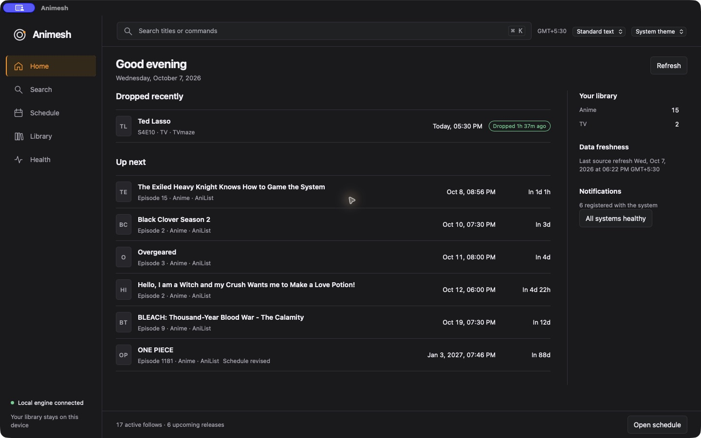
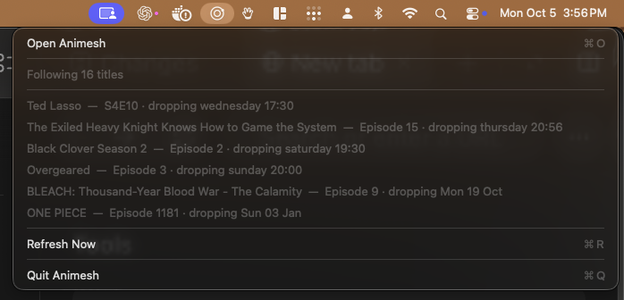
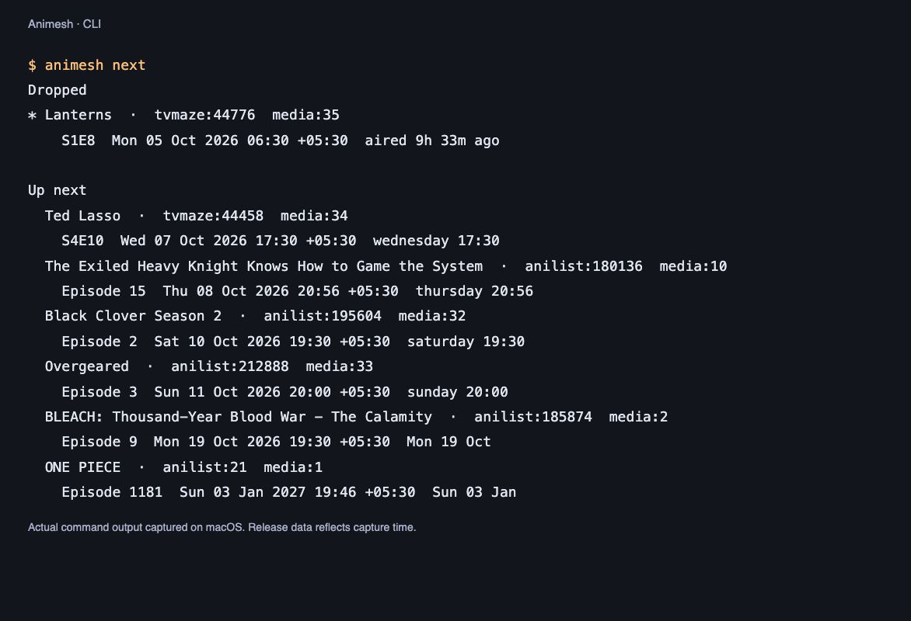

# animesh

A local-first release radar for macOS and Linux. Follow the shows you care
about, see what is next, and get notified when an episode drops. Your library
lives in a SQLite database on your machine — no account or cloud sync. Searches
and schedule updates contact AniList and TVmaze. Anime and TV are supported.



The desktop app has Home, Search, Schedule, Library, and Health.
Search and follow titles by name, see their next release, and keep tracking
when the window is closed. On macOS, a menu-bar view keeps upcoming episodes
one click away. The CLI uses the same local library.

## Download

Get the [latest release](https://github.com/Abhi-Gautam/animesh/releases/latest)
for **macOS 13+** or **Ubuntu 24.04 / compatible Linux**. Both platforms support
Apple Silicon / ARM64 and Intel / x86_64 as appropriate. Downloads include
checksums, disk images or Debian packages, and tarballs with install instructions.

| System | Recommended package |
| --- | --- |
| Mac with Apple Silicon | `aarch64-apple-darwin.dmg` |
| Mac with Intel | `x86_64-apple-darwin.dmg` |
| Linux x86_64 | `amd64.deb` |
| Linux ARM64 | `arm64.deb` |

The current macOS downloads are **not notarized** and may need approval in
Privacy & Security. Homebrew builds from source and is another install option.

Animesh is an early release. Commands and protocols can change, so read release
notes before updating and back up your library before experimenting. Known
schedules remain available offline; searches and refreshes contact AniList and
TVmaze. It tracks release dates and sends reminders; watch episodes through
your streaming service. Source times do not guarantee regional availability.

I built it because keeping up meant opening Crunchyroll and a countdown site
and doing it again an hour later:
[I just wanted to know when an episode dropped](https://syntropicsystems.dev/writing/animesh/)
is the long version.

## Install

```bash
brew tap abhi-gautam/animesh https://github.com/Abhi-Gautam/animesh
brew install abhi-gautam/animesh/animesh
animesh service start
```

The tap is this repository, so the formula always matches the code.

On macOS, open Animesh and choose **Open Animesh** from its menu bar.
Homebrew builds the full app locally; the first install takes longer.

On Ubuntu 24.04 or newer, download the `.deb` matching your architecture from
the [latest release](https://github.com/Abhi-Gautam/animesh/releases/latest):

```bash
sudo apt install ./animesh_0.7.1_amd64.deb  # x86_64; use arm64 on ARM
```

Open **Animesh** from your applications menu. It starts the background service
on first launch. The package includes the desktop app, CLI, daemon, and icons;
your package manager installs the required WebKitGTK libraries. Linux Homebrew
also builds the full desktop app.

For a CLI-only installation from crates.io:

```bash
cargo install animesh --locked
animesh service start
```

This installs the CLI and daemon. The desktop app is distributed through
Homebrew and the release downloads. macOS notifications need an app bundle,
so prefer Homebrew there.

Prebuilt macOS disk images and tarballs (Apple Silicon and Intel), plus Linux
packages and tarballs (x86_64 and ARM64), are attached to each
[release](https://github.com/Abhi-Gautam/animesh/releases). Downloads include
SHA-256 checksums, and tarballs contain an `INSTALL.txt`. Linux tarballs include
`install.sh` for a user installation. They require WebKitGTK 4.1 and Ubuntu
24.04 or a compatible newer system.

The macOS downloads are ad-hoc signed and are not notarized. macOS may require
allowing the app in Privacy & Security after download. Homebrew avoids this
download approval by building from source.

`service start` registers the background process with launchd or systemd and
keeps it running across restarts. On macOS it asks for notification permission
the first time; declining is fine, since nothing in the CLI depends on it.

## Commands

```bash
animesh search "one piece"   # find a title on AniList
animesh follow anilist:21    # follow it
animesh follow tvmaze:82     # follow a TVmaze show (or: follow --tv 82)
animesh drop media:1         # stop following, by the token list/next print
animesh next                 # upcoming episodes; local only, never hits the network
animesh list                 # everything you follow
animesh refresh              # pull schedules now
animesh status               # health, and what to do about it
animesh skill install        # let any AI agent read and edit your library
```

`service` also takes `stop`, `restart` and `status`. It is a repair tool — the
daemon is registered at install and is not otherwise your concern.

Exit codes: `0` success, `1` bad input, `2` needs intervention, `3` temporary—retry.

## A quick glance, or a command away





These are real captures, with release information from capture time.

## Agents

Every command takes `--json` and answers with one line:

```bash
$ animesh --json next -n 3
{"data":[...],"kind":"upcoming","ok":true}
```

Failures answer `{"error":{"code":...},"ok":false}` on stdout. The `code` is
meant to be branched on; the message is prose and will change.

`animesh skill install` writes an [Agent Skill](https://agentskills.io) to
`~/.agents/skills/animesh/` — the vendor-neutral location read by Codex,
Cursor, Gemini CLI, Copilot, OpenCode and Goose — and mirrors it to
`~/.claude/skills/` when Claude Code is installed. An agent can then answer
what is airing tonight, follow something for you, or read what you actually
watch before recommending anything, against your library, on your machine.

`animesh skill status` says where it landed; `animesh skill uninstall` removes it.

## Website and release signing

The [website source](site/README.md) is a small static site with real Mac/Linux
screenshots and release-specific download links. Hosting is configured separately.
Future signed Mac releases use the [Developer ID setup](docs/macos-signing.md).
The current release remains ad-hoc signed.

## Development

The desktop Command Center uses Tauri 2 with plain HTML, CSS, and TypeScript.
It connects to the existing daemon; the daemon owns the library, source calls,
refresh policy, and notifications. Home, Search, Schedule, Library,
and Health share a fixed header and footer with scrolling content between them.
On macOS, **Open Animesh** in the menu bar opens the bundled desktop app.

Desktop builds need Node.js and the TypeScript dependency:

```bash
npm ci --prefix desktop/ui
npm run build --prefix desktop/ui
cargo build --manifest-path desktop/Cargo.toml --locked
```

Linux desktop builds also need the [Tauri system dependencies](https://v2.tauri.app/start/prerequisites/#linux)
and `desktop-file-utils` to validate the launcher.
The macOS installer below builds and signs the desktop app inside the main
bundle, so the menu bar, CLI, and desktop are installed together.

```bash
cargo build
cargo test
cargo clippy --all-targets -- -D warnings
```

On macOS the app has to run from a bundle, because notifications need a bundle
identifier. This builds one and links the CLI into `~/.local/bin`, which needs
to be on your `PATH`:

```bash
cargo xtask install
animesh service start
```

On Linux, build and verify all three executables and the desktop assets:

```bash
npm ci --prefix desktop/ui
cargo xtask bundle --release
cargo xtask verify --path target/bundle/animesh
python3 scripts/package-release.py x86_64-unknown-linux-gnu
```

Packaging uses Python 3.11 or newer and Debian's `dpkg-dev`. Use
`aarch64-unknown-linux-gnu` on ARM64. The release workflow builds natively on
each supported architecture and exercises the installed Linux desktop through
WebKit WebDriver at both supported window sizes before publishing.

The database lives at `~/Library/Application Support/Animesh/library.db` on
macOS and `~/.local/share/animesh/library.db` on Linux. Build with
`--features test-harness` to relocate it; set both `ANIMESH_DATA_ROOT` and
`ANIMESH_LOG_ROOT`, or neither takes effect.

## Data sources

Anime schedules come from [AniList](https://anilist.co). TV schedules come from
[TVmaze](https://www.tvmaze.com), used under
[CC BY-SA](https://creativecommons.org/licenses/by-sa/4.0/).

## License

MIT
